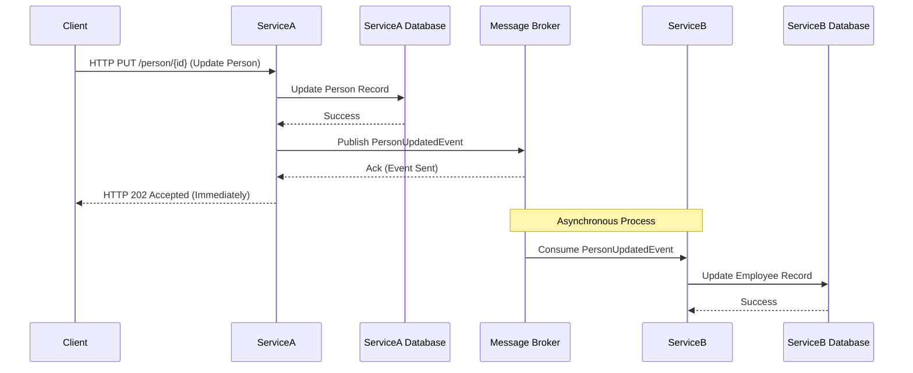

-----

# Inter-ServiceCommunicationModels

This repository is a project that comparatively demonstrates three different communication methods used in microservice architecture. The project shows how you can implement **gRPC**, **HTTP**, and **Message Broker** based communication models in a .NET environment.

## Communication Models

The project is divided into three main folders: `gRPC`, `http`, and `MessageBroker`. Each folder contains examples using a different communication model between two services (`ServiceA` and `ServiceB`).

### 1. HTTP (Synchronous)

This model demonstrates synchronous communication through traditional RESTful API calls. The client sends a request to the server and waits for a response. This method is easy to understand but can create a tight coupling between services.

#### Diagram: Synchronous HTTP Communication

```mermaid
sequenceDiagram
    participant Client
    participant ServiceA
    participant DatabaseA as ServiceA Database
    participant ServiceB as HTTP Service
    participant DatabaseB as ServiceB Database

    Client->>ServiceA: HTTP PUT /person/{id} (Update Person)
    ServiceA->>DatabaseA: Update Person Record
    DatabaseA-->>ServiceA: Success
    ServiceA->>ServiceB: HTTP PUT /employee/{id} (Update Employee)
    ServiceB->>DatabaseB: Update Employee Record
    DatabaseB-->>ServiceB: Success
    ServiceB-->>ServiceA: HTTP 200 OK
    ServiceA-->>Client: HTTP 200 OK
````

### 2\. gRPC (Synchronous)

gRPC is a high-performance, language-agnostic RPC (Remote Procedure Call) framework developed by Google. This model is faster and uses less bandwidth than HTTP.

#### Diagram: Synchronous gRPC Communication

```mermaid
sequenceDiagram
    participant Client
    participant ServiceA
    participant DatabaseA as ServiceA Database
    participant ServiceB as gRPC Service
    participant DatabaseB as ServiceB Database

    Client->>ServiceA: gRPC Call (Update Person)
    ServiceA->>DatabaseA: Update Person Record
    DatabaseA-->>ServiceA: Success
    ServiceA->>ServiceB: gRPC Call (Update Employee)
    ServiceB->>DatabaseB: Update Employee Record
    DatabaseB-->>ServiceB: Success
    ServiceB-->>ServiceA: gRPC Response
    ServiceA-->>Client: gRPC Response
```

### 3\. Message Broker (Asynchronous)

This model enables services to communicate indirectly through a message queue. One service publishes an event, and other services listen for and process this event. This approach provides loose coupling, high scalability, and fault tolerance between services.

#### Diagram: Asynchronous Message Communication



## Technologies Used

  - **.NET 7/8:** The project is developed on the .NET platform.
  - **gRPC:** Used for high-performance synchronous communication.
  - **HTTP/REST:** Used for traditional synchronous communication.
  - **MongoDB:** A NoSQL database used as a data store for the services.
  - **MassTransit:** A distributed application framework that simplifies working with RabbitMQ.
  - **RabbitMQ:** A message broker used for asynchronous communication.
  - **Docker:** Used to easily run RabbitMQ in a local environment.

## Getting Started

### Prerequisites

  - [.NET SDK](https://dotnet.microsoft.com/download)
  - [Docker Desktop](https://www.docker.com/products/docker-desktop/)

### Running the Project

1.  **Clone the repository:**
    `git clone https://github.com/devlightening/Inter-ServiceCommunicationModels.git`
    `cd Inter-ServiceCommunicationModels`

2.  **Run RabbitMQ (for the Message Broker model):**
    `docker run -d --hostname my-rabbit --name rabbit -p 5672:5672 -p 15672:15672 rabbitmq:3-management`

3.  **Start the services:**
    Open the solution in Visual Studio and start the relevant services for your desired communication model (`http`, `gRPC`, or `MessageBroker`). You can use the `Multiple startup projects` setting to run the services simultaneously.

4.  **Access the APIs:**
    You can use tools like Swagger UI or Postman to interact with the services and observe the communication models in action.

<!-- end list -->

```
```
